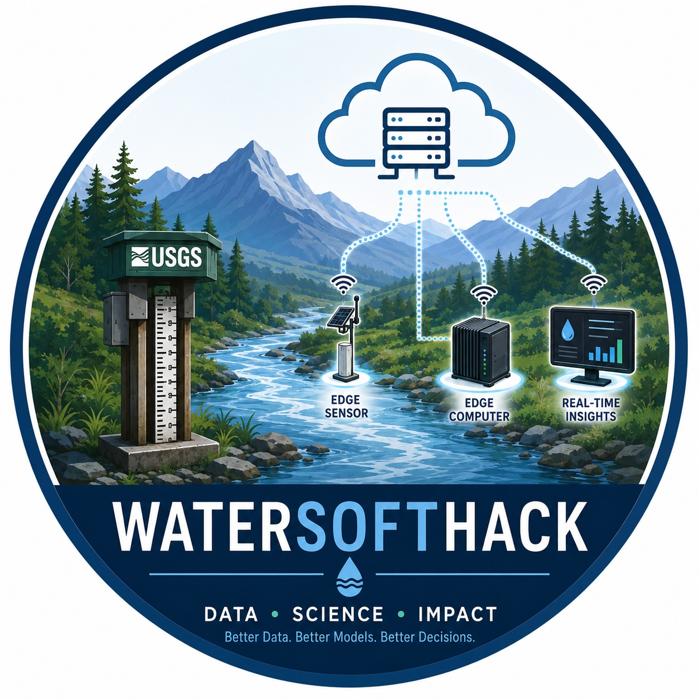

<p align="center">
  
</p>

<h1 align="center">WaterSoft 2026 Capstone</h1>

## Flood-stage forecasting for the Nueces River basin

This repository contains a reproducible workflow for forecasting flood stage
at **USGS 08210000 — Nueces River near Three Rivers, Texas**. It integrates
upstream USGS gauge observations, station-specific flood thresholds, NOAA
National Water Model (NWM) output, USGS discharge–stage rating curves, and
long short-term memory (LSTM) predictions.

The project has two complementary evaluation components:

1. **Historical-event evaluation:** major floods are identified from USGS
   observations and compared with NWM v3.0 retrospective simulations and
   LSTM predictions.
2. **Near-real-time evaluation:** the previous seven days of operational NWM
   Analysis and Assimilation output are joined to the latest Short-Range
   forecast. NWM and LSTM forecasts are then compared over a common forecast
   horizon as observations become available.

NWM discharge is converted to estimated gauge height through linear
interpolation of the USGS rating curve for the target station. This permits
direct comparison of NWM output, LSTM predictions, observations, and NWS
flood-stage thresholds in feet.

## Study gauges

The primary gauges used by the LSTM workflow are:

| USGS site | Role |
|---|---|
| `08194000` | Upstream predictor — Nueces River at Cotulla |
| `08194500` | Upstream predictor — Nueces River near Tilden |
| `08210000` | Forecast target — Nueces River near Three Rivers |

Additional basin gauges and metadata are defined in
[`config/gauges.csv`](config/gauges.csv).

## Repository structure

```text
WaterSoft26_Capstone/
├── config/                  # Gauge configuration
├── data/
│   ├── raw/                 # Downloaded USGS and NOAA data (not committed)
│   ├── interim/             # Intermediate metadata
│   ├── processed/           # Analysis products (mostly not committed)
│   └── samples/
├── docs/
│   ├── assets/
│   └── figures/             # Selected and generated figures
├── notebooks/
│   ├── 01_EDA.ipynb
│   ├── LSTM_code.ipynb
│   └── predict_major_events_v2.ipynb
├── scripts/                 # Numbered data and analysis workflow
├── src/watersoft/
├── tests/
├── requirements.txt
└── README.md
```

## Installation

Python 3.10 or newer is recommended.

```bash
git clone https://github.com/zandi-omid/WaterSoft26_Capstone.git
cd WaterSoft26_Capstone

python -m venv .venv
source .venv/bin/activate
python -m pip install --upgrade pip
python -m pip install -r requirements.txt
```

Conda users can activate their environment and run the same requirements
command.

## Workflow

### 1. Build gauge metadata

```bash
python scripts/01_download_usgs_metadata.py
python scripts/02_build_master_metadata.py
```

These scripts retrieve USGS station metadata and combine it with
project-specific river names, NWM ReachIDs, and action, minor, moderate, and
major flood-stage thresholds.

### 2. Download and prepare USGS observations

```bash
python scripts/03_download_usgs_timeseries.py
python scripts/04_fill_usgs_timeseries_gaps.py
```

The downloader retrieves:

- parameter `00060`: streamflow in cubic feet per second;
- parameter `00065`: gauge height in feet.

Observations are stored in long and wide formats. The gap-filling workflow
preserves the original downloads and writes separate filled datasets.

### 3. Characterize flow and flood events

```bash
python scripts/05_compute_flow_duration_curves.py
python scripts/06_flood_duration_statistics.py
python scripts/07_flood_wave_propagation.py --event-rank 1
```

Major-stage events at USGS 08210000 are ranked by the duration for which gauge
height remains at or above the major flood threshold. Flood-wave propagation
is evaluated using the timing of peaks at upstream gauges relative to the
target.

### 4. Retrieve a USGS rating curve

```bash
python scripts/08_download_usgs_rating_curve.py
```

The processed rating table relates discharge to gauge height at USGS
08210000. NWM-derived stage is reported only within the rating curve's
published discharge range unless boundary clipping is explicitly enabled.

### 5. Retrieve historical NWM simulations

Example for calendar year 2013:

```bash
python scripts/09_retrieve_nwm_retrospective_gauge_height.py \
  --site-id 08210000 \
  --reach-id 3168766 \
  --start 2013-01-01 \
  --end 2013-12-31
```

This script reads hourly streamflow for the selected NWM ReachID from the
NOAA NWM v3.0 retrospective Zarr archive on AWS and converts it to
USGS-equivalent gauge height. The retrospective simulation is distinct from
the operational NWM and does not assimilate observed USGS streamflow.

### 6. Compare historical flood-wave behavior

```bash
python scripts/10_flood_wave_propagation_NWM_included.py \
  --event-rank 1
```

The script creates stacked upstream-to-downstream hydrographs, event summaries,
and target-gauge comparisons. LSTM predictions are selected by the same
major-event rank.

### 7. Retrieve operational NWM data

```bash
python scripts/RetrieveNWM.py \
  --history-days 7 \
  --forecast-hours 18
```

The operational workflow:

- finds the latest complete NWM Short-Range cycle;
- retrieves seven days of hourly Analysis and Assimilation output;
- retrieves forecast leads 1–18 from the selected Short-Range cycle;
- extracts streamflow for ReachID `3168766`;
- converts streamflow to estimated gauge height; and
- writes one continuous UTC time series.

For a reproducible cycle selection:

```bash
python scripts/RetrieveNWM.py \
  --as-of 2026-07-30T20:00:00Z \
  --history-days 7 \
  --forecast-hours 18
```

### 8. Plot operational NWM, LSTM, and USGS data

```bash
python scripts/11_plot_operational_nwm_usgs.py
```

This script:

- selects the newest operational NWM CSV by default;
- downloads matching USGS gauge-height observations;
- plots the NWM Short-Range forecast;
- reads event-rank 5 LSTM predictions;
- uses the first LSTM step from earlier issue cycles and the full trajectory
  from the latest issue cycle;
- displays the NWS flood-stage thresholds; and
- saves hourly comparison data and evaluation metrics.

Alternative NWM and LSTM files can be supplied explicitly:

```bash
python scripts/11_plot_operational_nwm_usgs.py \
  --nwm-file path/to/operational_nwm.csv \
  --lstm-file path/to/lstm_forecasts.csv \
  --lstm-event-rank 5
```

## LSTM notebooks

Launch Jupyter Lab:

```bash
jupyter lab
```

The tracked notebooks are:

- [`01_EDA.ipynb`](notebooks/01_EDA.ipynb): metadata, coverage, missingness,
  duplicates, descriptive statistics, and time-series visualization;
- [`LSTM_code.ipynb`](notebooks/LSTM_code.ipynb): LSTM preparation and
  training workflow;
- [`predict_major_events_v2.ipynb`](notebooks/predict_major_events_v2.ipynb):
  inference for ranked major events and near-real-time periods.

For a direct LSTM–NWM forecast comparison, both models must use the same issue
time, hourly valid times, and forecast horizon. If an issue occurs at time
`t`, an 18-hour forecast should be timestamped from `t + 1 hour` through
`t + 18 hours`.

## Key outputs

Generated products include:

- master gauge metadata and flood thresholds;
- long- and wide-format USGS observations;
- flow-duration curves and flood-duration summaries;
- ranked major events and peak-lag statistics;
- processed USGS rating curves;
- retrospective and operational NWM streamflow and gauge height;
- hourly NWM–USGS comparison tables;
- LSTM forecast tables; and
- publication-quality flood-wave and forecast figures.

Large downloaded and generated datasets are intentionally excluded from Git.
They should be reproduced locally by running the corresponding scripts.

## Collaboration

Create changes on a feature branch and submit a pull request:

```bash
git switch main
git pull --ff-only
git switch -c feature/my-feature

# Make and verify changes

git add .
git commit -m "Describe the change"
git push -u origin feature/my-feature
```

## Acknowledgment

This project was developed as part of WaterSoftHack 2026, a cybertraining
initiative for water-science students and researchers.
